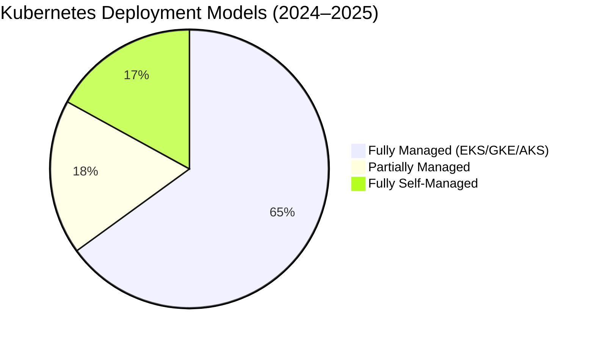
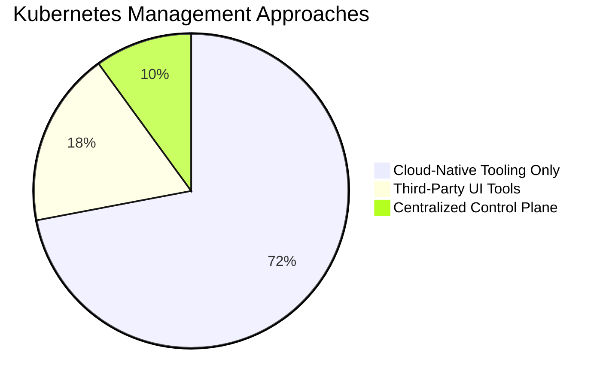

# Platform Engineering vs Cluster Management

### A DevOps & Platform Engineering Perspective

**Focus:** Industry trends, architecture shifts, and operating models  
**Not:** Product criticism or feature comparison

Audience: CTOs, Platform Engineers, Senior DevOps  
Date: 2026


# Slide 1 — Managed Kubernetes Is Now the Default

## Key point

Most organizations no longer operate Kubernetes control planes themselves.  
They consume Kubernetes as a managed cloud service.

## Key stats

- **60–70%** of Kubernetes workloads run on **managed Kubernetes** (EKS / GKE / AKS)
- **15–20%** partially managed
- **10–20%** fully self-managed (kubeadm, RKE, bare metal)
- **82%** of container users run Kubernetes in production
- **~98%** of organizations use cloud-native technologies




# Slide 2 — Teams Avoid Third-Party Cluster Managers

## Key point
Modern teams intentionally avoid centralized cluster control planes.

## Key stats
- ~72% of organizations manage Kubernetes using **cloud-native tooling only**
- <25% use any third-party Kubernetes management UI
- <15% operate a centralized multi-cluster control plane



# Slide 3 — Platform Engineering Changed the Problem

## Key point
The industry moved from **managing clusters** to **enabling developers**.

## Key stats
- **55–65%** of organizations invest in **Platform Engineering / Internal Developer Platforms**
- **~77%** of organizations have adopted **GitOps**
- Developer experience, self-service, and speed are top priorities

```mermaid
xychart-beta
    title Organizational Focus Shift
    x-axis Category
    y-axis Adoption (%)
    "Platform Engineering" : 60
    "Classic DevOps" : 25
    "Infra-Centric Ops" : 15
```
